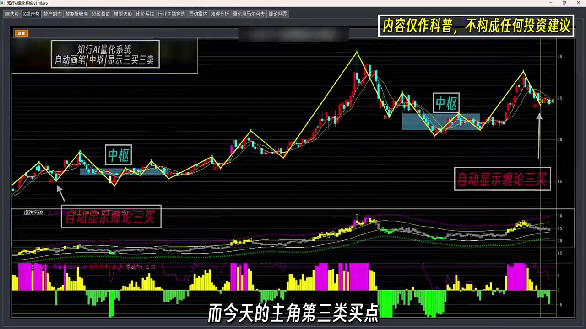

# 2024-01-08 每日复盘：下的，结构分化中的机会挖掘

今天是2024-01-08，我们对全市场0只个股进行系统性复盘。

**大盘定调**: 上证指数收于0.0点（+0.00%）。
**情绪与量能**: 周期。 系统未检测到极端风险信号。
**买卖格局**: 全市场买点信号0只，卖点信号0只。买卖信号接近，市场处于均衡状态，等待方向选择。
**结构特征**: 上涨趋势0只（0.0%），盘整0只，下跌趋势0只。涨停0只，跌停0只。

---

## 一、大盘环境深度体检

| 指标 | 数值 | 指标 | 数值 |
|------|------|------|------|
| 上证指数 | 0.0 | 涨跌幅 | +0.00% |
| 量能 |  (1.0x均量) | 情绪周期 |  |
| 市场状态 |  (置信度 0%) | 风格 |  |
| 动量 | +0.00 | 波动率 | 0.0% |
| 上涨/下跌 | 0 / 0 (0%) | 涨停/跌停 | 0 / 0 |
| 综合判定 | 数据不足，无法完成大盘体检 | 熊市风险 | ✓ 否 |

## 二、行业主线分析

无数据

## 四、缠论买卖点机会

| 买点类型 | 数量 | 说明 |
|----------|------|------|

## 五、风险预警

| 风险类型 | 数量 | 说明 |
|----------|------|------|

## 六、重点个股截图占位（请手动截图替换）

> 请在交易软件中截取以下个股的日K线图（含MA5/MA10/MA20/MA60均线 + MACD指标 + 成交量），
> 保存为 `charts/XXXXXX_Kline.png` 后替换下方占位符。

暂无需要截图的重点标的。

## 七、持仓评估与明日调仓计划

**仓位建议**: 中性仓位 (3-5成) | **可用资金**: ¥150,000

### 当前持仓评估

持仓 2 只，总市值 ¥0，浮动盈亏 ¥-150,810

| 代码 | 名称 | 持仓(股) | 成本 | 现价 | 市值 | 盈亏% | 走势 | 买点 | 卖点 | 风险 | 操作建议 |
|------|------|----------|------|------|------|-------|------|------|------|------|----------|
| 002166 |  | 9,100 | 8.68 | 0.00 | 0 | +0.0% | - | 0 | 0 | 未知 | 关注 |
| 300206 |  | 5,200 | 13.81 | 0.00 | 0 | +0.0% | - | 0 | 0 | 未知 | 关注 |

#### 002166 

| 项目 | 内容 |
|------|------|
| 收盘价 | 0.00 (+0.0%) |
| 持仓 | 9100股, 成本8.68, 市值¥0, 盈亏+0.0% |
| 缠论结构 |  |
| 买卖点 | 买点=0, 卖点=0 |
| 背驰 | 无数据 |
| 量价 | 无数据 |
| 综合评分 | +0.00 (-级), 风险=未知 |
| 关键价位 |  |
| 风险信号 |  |
| 操作建议 | **关注** — 未在诊断范围 |

#### 300206 

| 项目 | 内容 |
|------|------|
| 收盘价 | 0.00 (+0.0%) |
| 持仓 | 5200股, 成本13.81, 市值¥0, 盈亏+0.0% |
| 缠论结构 |  |
| 买卖点 | 买点=0, 卖点=0 |
| 背驰 | 无数据 |
| 量价 | 无数据 |
| 综合评分 | +0.00 (-级), 风险=未知 |
| 关键价位 |  |
| 风险信号 |  |
| 操作建议 | **关注** — 未在诊断范围 |

### 今日选股: 未运行

> 提示: 运行 `python export_selection.py` 生成选股结果后，报告中会自动包含调仓计划。

### 作战计划（策略选股 × 缠论诊断）

无符合条件的推荐标的

## 八、系统准确率进化记录

> 每次复盘自动评估前一日推荐标的的实际表现，记录方向准确率和超额收益。
> 观察准确率趋势可判断系统参数调整是否有效。

| 日期 | 回测日 | 方向准确率 | 平均收益 | 超额收益 | 信号数 |
|------|--------|------------|----------|----------|--------|
| 2026-05-18 | 20260517 | ✗ 0% | +0.00% | +0.00% | 0/79 |
| 2026-05-19 | 20260518 | ✗ 0% | +0.00% | +0.00% | 0/79 |

## 九、系统自进化建议

- 🟠 **[signal.buy_threshold]**
  - 当前值: `0.06` → 建议值: `0.04`
  - 理由: 买点信号稀少(0.0%)，建议降低买入阈值以捕获更多机会
  - 置信度: 70%

## 十、复盘反思

### 今日市场要点

- 市场状态: ，情绪周期: ，风格偏向: 
- 全市场买点信号 0 只（B1一买: 0, B2二买: 0, B3三买: 0）
- 卖点信号 0 只，高危股票 0 只
- A级机会 0 只，B级机会 0 只
- 涨停 0 只，跌停 0 只

### 结构判断反思

- 买点信号占比仅0.0%，市场整体做多动能不足。
  - 反思: 是否选股条件过严？是否需要关注结构性机会而非系统性机会？
- 买卖信号接近（买0/卖0），市场处于均衡状态。
- 趋势分布: 上涨0.0% / 盘整0.0% / 下跌0.0%
- 强主线 0 个: 
  - 反思: 主线匮乏，市场缺乏共识方向，以防御为主。

### 系统改进备忘

- A级机会为0（共0只B级以上），信号质量偏弱。
  - 建议: 检查Chan理论参数是否需要调整，或当前市场不适合操作。

## 十一、附：缠论三类买卖点完全图解

> 上图完整展示了缠论六种买卖点的形态结构。以下为理论要点：

### B1 第一类买点（一买）— 底背驰终结下跌趋势
- 第21课: 下跌趋势末端出现底背驰，空头力竭
- 第24课: MACD柱面积明显缩小，黄白线未同步新低
- 判定: 价格创近期新低，但对应段MACD柱面积比前一段明显缩小
- 操作: MACD金叉确认后买入，止损设在前低下方2-3%

### B2 第二类买点（二买）— 回踩不破一买低点
- 第21/49课: 一买后次级别回踩，不创新低，最安全的买点
- 判定: B1后回踩，最低点高于B1低点，成交量萎缩，MACD未破0轴
- 操作: 回踩止跌+MACD再次金叉时加仓，止损在B1低点下方

### B3 第三类买点（三买）— 突破中枢后回踩确认
- 第21/54课: 突破中枢上沿，次级别回踩不跌回中枢
- 判定: 价格突破中枢上沿，次级别回踩不跌回中枢区间，成交量放大配合
- 重要前提: 至少两个同向向上不重叠的中枢（形成趋势），底部首个中枢的B3最优
- 操作: 放量突破中枢上沿+回踩确认后介入，止损在中枢上沿下方

### S1 第一类卖点（一卖）— 顶背驰终结上涨趋势
- 第21课: 上涨趋势末端出现顶背驰，多头力竭
- 判定: 价格创近期新高，但对应段MACD柱面积比前一段明显缩小
- 操作: 顶背驰+MACD死叉时减仓或清仓

### S2 第二类卖点（二卖）— 反弹不破一卖高点
- 第21课: 一卖后反弹，不创新高，反弹无力
- 判定: S1后出现反弹，但反弹高点低于S1高点，MACD无力回到0轴上方
- 操作: 反弹无力+MACD再次死叉时清仓

### S3 第三类卖点（三卖）— 跌破中枢后反抽不涨回
- 第21课: 跌破中枢下沿，次级别反抽不涨回中枢
- 判定: 价格跌破中枢下沿，次级别反抽未能涨回中枢区间，MACD在0轴下方
- 操作: 跌破中枢下沿+反抽无力时清仓离场，不要抄底

### 三类买卖点速查表

| 买卖点 | 定义 | 关键特征 | MACD特征 | 操作 |
|--------|------|----------|----------|------|
| B1一买 | 下跌趋势底背驰终点 | 价格新低, 背驰确认 | MACD柱面积缩小, 黄白线未同步新低 | 金叉买入, 前低止损 |
| B2二买 | 回踩不破一买低点 | 一买后次级别回踩 | 回踩段MACD回0轴不破 | 再次金叉加仓, B1低点止损 |
| B3三买 | 突破中枢上沿回踩 | 中枢上沿+次级别回踩确认 | 突破时MACD站上0轴 | 放量突破回踩买入 |
| S1一卖 | 上涨趋势顶背驰终点 | 价格新高, 背驰确认 | MACD柱面积缩小, 黄白线未同步新高 | 死叉减仓/清仓 |
| S2二卖 | 反弹不破一卖高点 | 一卖后反弹无力 | 反弹段MACD无力回0轴上方 | 再次死叉清仓 |
| S3三卖 | 跌破中枢下沿反抽 | 中枢下沿+反抽不涨回 | 跌破时MACD下0轴 | 跌破反抽离场 |

## 复盘摘要

### 大盘速览

| 指数 | 涨跌 | 量能 | 市场状态 | 情绪 | 涨跌比 | 涨停/跌停 | 熊市风险 |
|------|------|------|----------|------|--------|-----------|----------|
| 0.0 | +0.00% |  | ⚪  | ➖  | 0% | 0/0 | ✓ |

### 结构全景

| 趋势分布 | 买点信号 | 卖点信号 | 高评级 | 高危 |
|----------|----------|----------|--------|------|
| ↑0(0.0%) →0(0.0%) ↓0(0.0%) | B1:0 B2:0 B3:0 (共0) | 0只 | A:0 B:0 | 0只 |

### 主线行业

- **强主线**(0个): 无
- **次主线**(0个): 无

### 今日操作建议

- **仓位**: 中性仓位 (3-5成)，主线内择优
- **关注**: 双级别确认买点0只，优先关注

- **准确率**: 最近 ✗ 0%，超额收益 +0.00%

> 📊 全市场个股明细: [缠论全量分析_20240108.csv](缠论全量分析_20240108.csv)
> 📈 准确率历史: accuracy_history.json

---
*报告由量化系统自动生成 | 缠论复盘引擎*